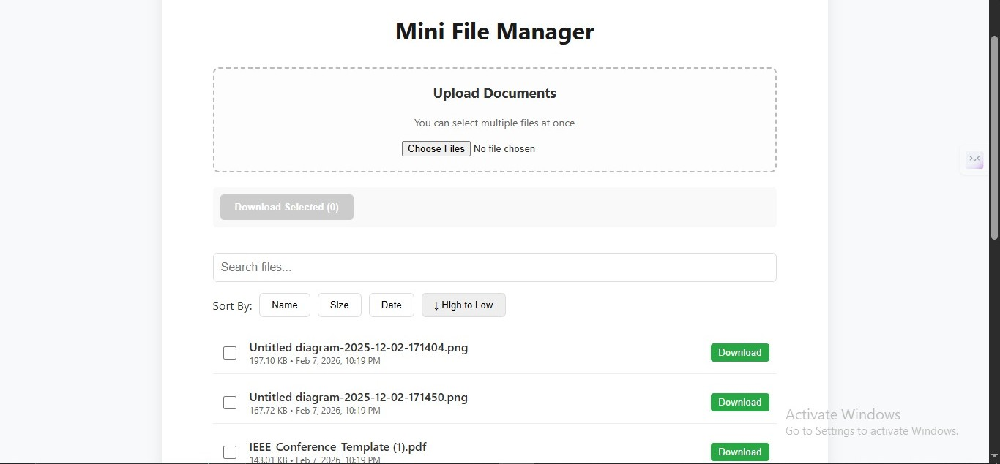
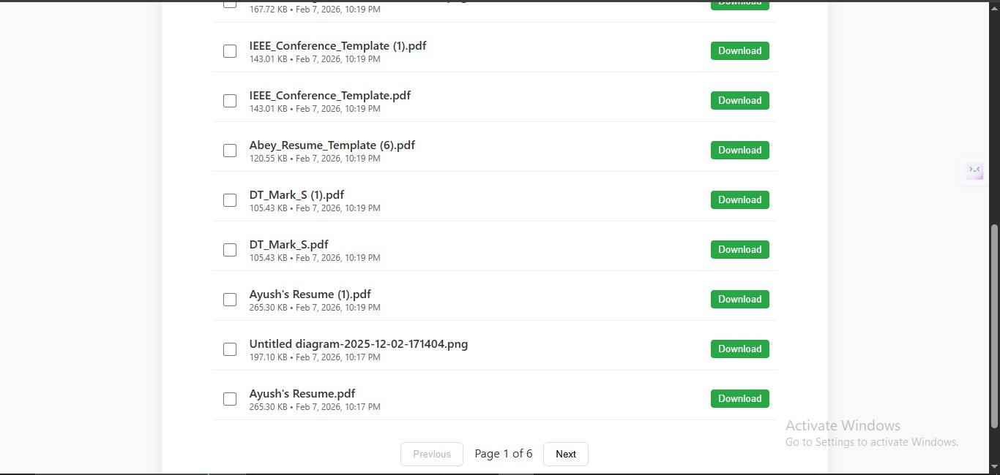
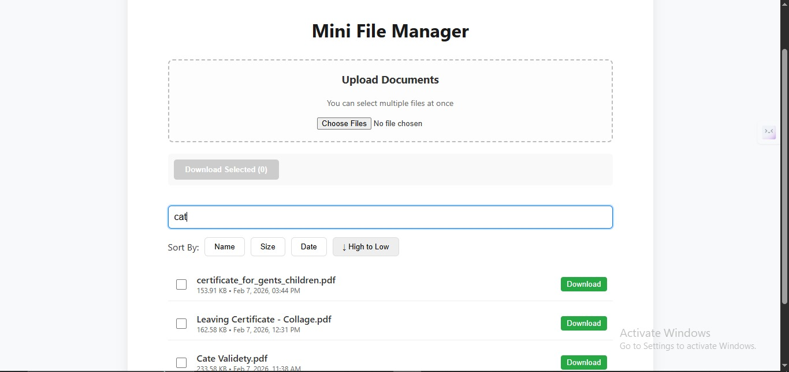
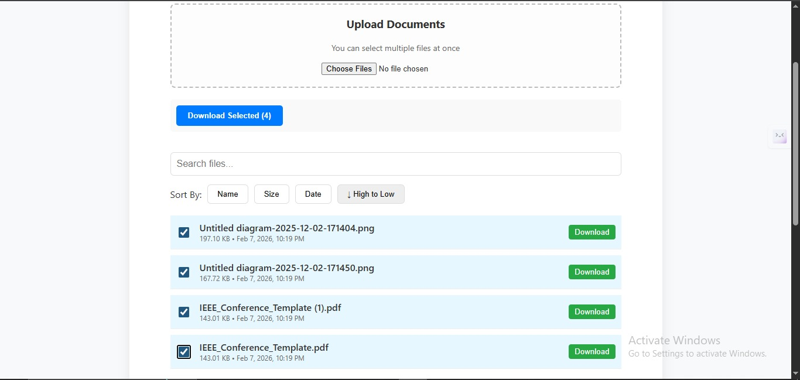

# Mini Document Manager

A full-stack document management system built with Node.js, Express, and React. This project demonstrates scalable file handling techniques including streaming downloads, bulk operations, and efficient database interactions.

## Features & Status

### Implemented (Working)
*   **Multiple File Uploads:** Upload multiple documents in a single HTTP request for efficiency.
*   **Streaming Downloads:** Files are streamed from disk to client, ensuring low memory usage (O(1)) regardless of file size.
*   **Bulk ZIP Downloads:** Select multiple files and download them as a single ZIP archive, generated and streamed on-the-fly without creating temporary files on disk.
*   **Server-Side Pagination & Sorting:** Efficiently handles large datasets by fetching only necessary records.
*   **Search:** Real-time text search on document titles.
*   **Antivirus Scanning:** Integrated ClamAV scanning for all uploads. *Note: Configured to "fail open" (allow upload) if the scanner service is unreachable, to prevent downtime during scanner maintenance.*

###  Not Implemented / Limitations
*   **File Previews:** Currently, there is no in-browser preview for documents (PDFs/Images).
*   **Upload Progress Bar:** The UI shows an "Uploading..." state but does not yet display a granular progress percentage.
*   **Authentication:** As per the assignment scope, no user login/auth is implemented.

###  Future Plans
*   **Cloud Storage Migration:** Move from local disk storage to AWS S3 using presigned URLs to offload bandwidth from the backend.
*   **Enhanced UX:** Add true upload progress bars using Axios event hooks.
*   **Document Previews:** Implement secure previews for PDFs and images using signed URLs and browser-native viewers.

---

##  Screenshots

Here are some screenshots showcasing the application:

### Upload Section


### File List and Search


### Pagination and Actions


### Bulk Download Feature


---

## 🛠 Setup & Assumptions

### Assumptions
*   **Node.js:** You have Node.js installed (v16+ recommended).
*   **ClamAV (Optional):** For antivirus scanning to work, `clamd` must be running locally. If not found, uploads will proceed without scanning.
*   **Local Storage:** Files are stored in a `uploads/` directory in the backend root. Ensure this directory is writable.

### Installation

1.  **Backend Setup**
    ```bash
    cd backend
    npm install
    node setup.js  # Initializes the database and creates necessary folders
    npm start
    ```
    *Server runs on `http://localhost:3000`*

2.  **Frontend Setup**
    ```bash
    cd frontend
    npm install
    npm run dev
    ```
    *Client runs on `http://localhost:5173`*

---

## Key Tradeoffs

*   **Local Disk vs. S3:** To keep the assignment self-contained and free of cloud dependencies, I used local disk storage. In a real-world scenario, this limits scalability (stateful servers). Moving to S3 would allow the backend to be stateless.
*   **Fail-Open Antivirus:** I chose to allow uploads if the antivirus scanner is offline. In a high-security environment, I would change this to "fail-closed" (reject upload), but for a general document manager, availability was prioritized over strict security during outages.
*   **Simple Search:** The search implementation uses a basic SQL/database `LIKE` query. For production scale, I would swap this for a dedicated search engine like Elasticsearch or Algolia to handle fuzzy matching and relevance ranking.

---

## Design Questions

### 1. Multiple Uploads
**"How does your system handle uploading multiple documents?"**

One request or many? My implementation uses a single HTTP request (`multipart/form-data`) to send all selected files at once.

*   **Why:** It’s more efficient for the user. Establishing a TCP/TLS connection takes time (latency). Doing it once for 5 files is faster than doing it 5 times.
*   **Trade-off:** If one file fails (e.g., it’s too big), the entire batch might be rejected depending on how the server is configured. A robust production system might use "concurrent uploads" (5 separate requests in parallel) so that if one fails, the others still succeed.
*   **Limits:** Currently, I rely on multer limits (e.g., 50MB per request).
*   **The Bottleneck:** If a user tries to upload 100 files, the browser might crash trying to read them all into memory before sending, or the request might time out.
*   **The Fix:** For massive scale, I would upload files sequentially or in small batches (e.g., 3 at a time) to keep the browser responsive.

### 2. Streaming (The "Senior Engineer" Question)
**"Why is streaming important?"**

Streaming is the difference between a toy app and a professional tool.

*   **The Problem (Loading into Memory):** Imagine a user downloads a 1GB video file. Without streaming, the server tries to read the entire 1GB into its RAM variable (`const fileData = fs.readFileSync(...)`). If 10 users do this simultaneously, your server needs 10GB of RAM.
    *   **Result:** The server runs out of memory (OOM) and crashes for everyone, even users who just wanted to view the homepage.
*   **The Solution (Streaming):** Streaming acts like a pipe. The server reads a tiny chunk from the disk (e.g., 64KB) and immediately pushes it to the network card.
    *   **Memory Usage:** It stays flat at ~64KB, regardless of whether the file is 1MB or 10TB.
    *   **Speed:** The user starts downloading immediately, rather than waiting for the server to "load" the file first.

### 3. Moving to S3 (Architecture Shift)
**"If files move to object storage (e.g., AWS S3), what changes?"**

This is a trick question. The naive answer is "I'll use the AWS SDK." The senior answer is about **Pre-signed URLs**.

*   **Naive Approach (Bad):** Client -> Uploads to Backend -> Backend Uploads to S3.
    *   *Why it's bad:* You are paying for double bandwidth (Ingress + Egress), and your server is still a bottleneck.
*   **Professional Approach (Presigned URLs):**
    1.  Client asks Backend: "I want to upload cat.jpg."
    2.  Backend asks S3: "Give me a secure, temporary key for this file."
    3.  Backend gives Client the key (URL).
    4.  Client uploads the file directly to S3.
*   **Does the backend handle file bytes?** No. In the professional approach, the backend never touches the file data. It only handles metadata (name, size, type) and permission checks. This makes the backend incredibly lightweight and scalable.

### 4. Frontend UX (If I had more time)
**Document Preview:** I would not build this from scratch.
*   **Images:** Easy, just use an `` tag with the signed URL.
*   **PDFs:** Use the browser's native `<iframe src="...">` or a library like `react-pdf`.
*   **Office Docs (Word/Excel):** This is hard. I would use a third-party viewer API (like Google Docs Viewer) or convert them to PDF on the server using a background job (LibreOffice headless).

**Upload Progress:** Currently, the user stares at a spinner. This is bad UX because they don't know if it froze.
*   **Implementation:** `axios` has a built-in event called `onUploadProgress`.
*   **The Fix:** I would hook into this event to calculate `(loaded / total) * 100` and display a simple progress bar. This gives the user confidence that "something is happening."
